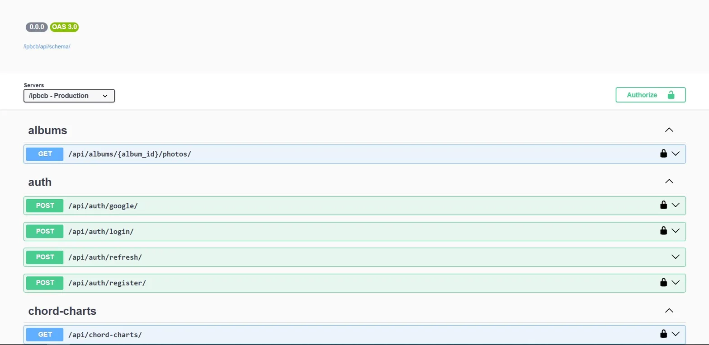

# IPBCB — API RESTful

[](https://python.org)
[](https://djangoproject.com)
[](https://www.django-rest-framework.org)
[](https://postgresql.org)
[](https://docker.com)
[](https://jwt.io)

API REST do sistema de gerenciamento da **Igreja Presbiteriana de Castelo Branco**, desenvolvida com Django e Django REST Framework. Gerencia membros, escala mensal, repertório musical e galeria de fotos.

---

## Tecnologias

- **Python 3.14** + **Django 6** + **Django REST Framework**
- **PostgreSQL 16** — banco de dados principal
- **SimpleJWT** — autenticação via tokens JWT
- **Google OAuth 2.0** — login social
- **drf-spectacular** — documentação OpenAPI/Swagger
- **Pydantic 2** — DTOs entre camadas de serviço
- **dependency-injector** — injeção de dependência
- **Gunicorn + Uvicorn** — servidor ASGI
- **Docker 28.5.2 / Docker Compose** — containerização

---

## Módulos

| App | Responsabilidade |
|---|---|
| `accounts` | Autenticação, cadastro e perfis de usuário |
| `members` | Diretório de membros da igreja |
| `songs` | Repertório, hinário, cifras e histórico de músicas tocadas |
| `schedule` | Geração automática da escala mensal |
| `gallery` | Álbuns e upload de fotos |

---

## Como Rodar

**Pré-requisito:** Docker Compose

```bash

git clone https://github.com/GabriellAfonso/ipbcb-api.git
cd ipbcb-api

# Renomeie o arquivo .env.example para .env 
cp .env.example .env

#Rode o docker compose para subir o ambiente
docker compose up --build
```

A API sobe em `http://localhost:8000`.

---

## Documentação da API

Com o servidor rodando, acesse:

| Interface | URL |
|---|---|
| Swagger UI | `/api/schema/swagger-ui/` |
| ReDoc | `/api/schema/redoc/` |
| Schema JSON | `/api/schema/` |



---

## Arquitetura

O projeto segue princípios de **Clean Architecture** com elementos de DDD:

```
server/
├── config/          # Configurações, URLs, DI container (di.py)
├── features/
│   ├── accounts/    # Auth, perfis, JWT, Google OAuth
│   ├── core/        # Domínio e application services compartilhados
│   │   ├── domain/
│   │   └── application/
│   ├── gallery/     # Álbuns e fotos
│   ├── members/     # Membros da igreja
│   ├── schedule/    # Escala mensal
│   └── songs/       # Repertório, hinário, histórico de plays
└── manage.py
```

Injeção de dependência via `dependency-injector`. Repositórios abstraem o acesso a dados, e serviços de domínio orquestram a lógica de negócio.

---

## App Android

O aplicativo mobile que consome esta API está disponível em: [ipbcb-app](https://github.com/GabriellAfonso/ipb_castelo_branco-APP)

---

GNU General Public License v3.0 — veja [LICENSE](./LICENSE) para detalhes.
